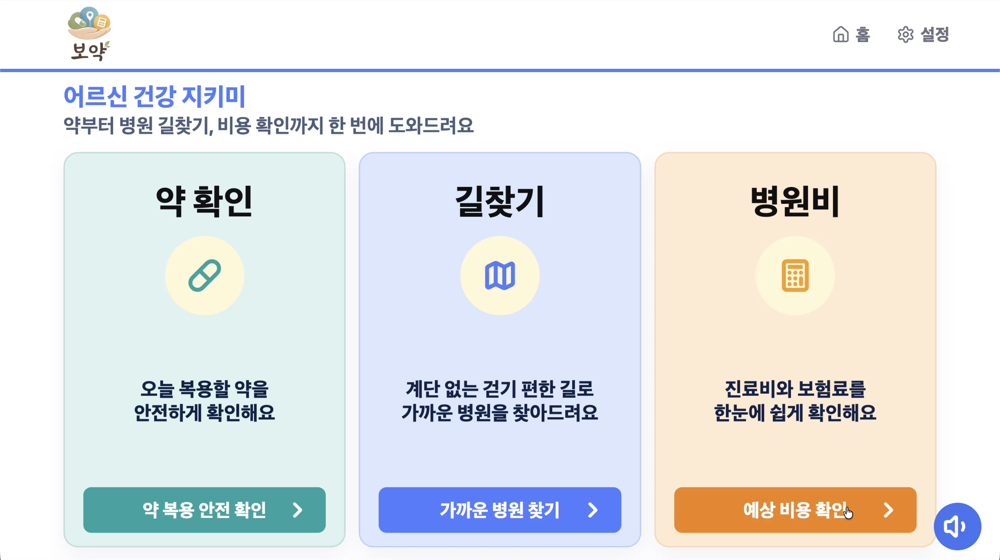

<div align="center">


# 보약 (Boyak)

### 어르신 건강 지키미 — 약부터 병원 길찾기, 비용 확인까지 한 번에

**스마트폰 조작이 서툰 독거노인도 스스로 사용할 수 있도록 단순화한 의료·복약 통합 어시스턴트**

[🌐 **서비스 바로가기 → boyak-sable.vercel.app**](https://boyak-sable.vercel.app/)

> 독거 어르신의 3가지 두려움을 해결합니다 — **약물 부작용 · 험한 이동 길 · 병원비 폭탄**

</div>

---

## 📖 보약이란?

**보약**은 디지털 환경에 익숙하지 않은 어르신도 혼자서 쓸 수 있도록 만든 **자립형 의료 접근성 플랫폼**입니다.
단순 병원 검색 앱이 아니라, 독거노인이 **스스로 복약 안전을 확인하고, 병원까지의 이동 경로를 파악하며, 예상 진료비까지 사전에 확인**할 수 있도록 돕습니다.

큰 글씨, 단 3개의 메뉴, 모든 화면의 **음성 안내(TTS)** 와 **음성 입력(STT)** 으로
어르신이 직접 약을 확인하고, 가까운 병원을 찾고, 진료비를 미리 가늠할 수 있습니다.

| 메뉴 | 하는 일 |
|------|--------|
| 💊 **약 확인** | 약봉투·처방전을 사진으로 찍으면 AI가 약 이름을 읽고, 병용금기·연령금기(DUR)를 분석해 **복용 안전 여부**를 알려줍니다. |
| 🗺️ **길찾기** | 증상을 말하면 알맞은 진료과의 **가까운 병원**을 찾고, 무릎·허리 등 신체 불편을 고려해 계단이 적은 **교통약자 중심 보행자 경로**로 안내합니다. |
| 🧮 **병원비** | 건강보험 기준 **예상 진료비**를 미리 보여줍니다. |

---

## 🖥️ 첫 화면

<div align="center">



</div>


---

## 🎯 기획 배경

대한민국은 빠르게 디지털 사회로 전환되고 있으나, 고령층은 여전히 모바일 앱과 디지털 서비스 이용에 어려움을 겪고 있습니다.

- **독거노인 증가** — 통계청 「국민 삶의 질 2024」에 따르면 독거노인 비율은 **22.1%** 로 꾸준히 늘고 있습니다.
- **디지털 문맹** — 고령층은 키오스크·모바일 앱 사용에 큰 어려움을 느끼며, 조사에서 **작은 글씨와 화면 가독성 문제를 불편 요소로 응답한 비율이 44.1%** 에 달했습니다.
- **의료 접근의 장벽** — 병원 방문 전 예상 비용을 알기 어렵고, 복용 중인 약을 함께 먹어도 되는지 확인하기 어려우며, 몸이 불편한 상태에서 병원까지 이동하는 과정도 부담입니다. 이로 인해 필요한 진료를 미루는 사례가 반복됩니다.

**보약**은 이러한 **심리적·신체적 장벽을 줄여** 독거노인이 스스로 건강을 챙길 수 있도록 돕기 위해 기획되었습니다.

---

## ⭐ 보약의 차별점

- **고령층 친화 UI** — 복잡한 메뉴를 최소화하고, 큰 글씨·고대비 화면과 음성 안내를 기본으로 제공합니다.
- **더 듣기 편한 음성** — 딱딱한 기계음(gTTS) 대신, 자연스럽고 부드러운 한국어 음성으로 안내해 어르신이 편안하게 들을 수 있습니다. *(기기에 맞는 부드러운 한국어 음성 자동 선택 + 자연스러운 안내 음성 옵션)*
- **교통약자 중심 길 안내** — 무릎·허리 등 신체 불편을 고려해 계단이 적은 평지 경로를 우선 추천합니다.
- **사진 한 장으로 복약 안전 확인** — 약봉투·처방전을 찍기만 하면 AI가 약을 인식하고 병용·연령 금기까지 분석합니다.
- **방문 전 비용 안내** — 진료비를 미리 알려 "얼마 나올지 모르는" 불안을 줄입니다.

---

## ✨ 주요 기능

### 💊 약 복용 안전 확인
- 약봉투·처방전 카메라/갤러리 촬영 → **AI OCR(GPT-4o-mini)** 로 약 이름 추출
- 로컬 SQLite DB + 심평원 의약품 쉬운정보 API로 약 이름 정규화
- **DUR 안전 분석**: 노인주의 · 연령금기 · 병용금기 확인 후 위험등급·원인·행동지침을 쉬운 말로 안내

### 🗺️ 병원 길찾기
- 증상 음성 입력 → 키워드 기반 진료과 매핑(9개 진료과)
- **TMap POI**로 반경 2km 병원 검색 + **무장애 보행자 경로** 병렬 조회
- 계단 수 기준 **평지 우선 정렬**, 가장 편한 병원에 "보행자 맞춤 추천" 배지
- Leaflet 지도 + 경로 표시, GPS 실시간 추적·도착 감지

### 🧮 병원비 예상
- 첫방문 기준 건강보험 급여 기준 예상 비용
- 병원비 관련 자주 물어보는 질문 FAQ

### 🔊 음성 접근성 (공통)
- 모든 화면 **한국어 음성 안내(TTS)** — 기계음 대신 듣기 편한 자연스러운 음성, 느리게 듣기 옵션 제공
- **음성 입력(STT)** 으로 타이핑 없이 증상·질문을 말로 전달
- 큰 글씨·고대비 UI로 어르신 접근성 강화

---

## 🗂️ 활용 공공데이터

식품의약품안전처·건강보험심사평가원(HIRA)의 공공데이터를 활용합니다.

| 데이터 | 출처 | 활용 |
|--------|------|------|
| DUR 의약품 안전정보 (병용금기·연령금기·노인주의) | 식약처 / 심평원 | 복약 안전성 분석 |
| 의약품 쉬운정보 (DrbEasyDrugInfo) | 심평원 | 약 이름 정규화·설명 |
| 수가기준 · 비급여 진료비 | 심평원(HIRA) | 예상 진료비 산정 |
| 병원 정보 · 진료비 통계 | 심평원(HIRA) | 병원 안내·비용 기준 |
| 보행자 경로 · 병원 POI | TMap | 교통약자 길 안내 |

---

## 👥 팀 구성 및 역할

| 이름 | 역할 |
|------|------|
| **김찬영** (팀장) | 화면 설계 · 길찾기 · STT · 배포|
| **박연정** | 화면 설계 · 프론트엔드 |
| **이채림** | STT · TTS · 백엔드 |
| **조민서** | OCR · 길찾기 |
| **최현우** | OCR · Docker · 진료비 통계 |

---

## 🛠️ 기술 스택

| 구분 | 사용 기술 |
|------|----------|
| **프론트엔드** | Next.js 14 · React 18 · Tailwind CSS · Leaflet / React-Leaflet |
| **백엔드** | FastAPI · Uvicorn · Pydantic · httpx |
| **AI / 음성** | OpenAI GPT-4o-mini (OCR·라우팅) · Groq Whisper (STT) · 자연스러운 한국어 TTS (Web SpeechSynthesis + 음성 클립, gTTS 폴백) |
| **데이터** | SQLite (DUR 로컬 인덱스) · 식약처·심평원 공공 API · TMap API |
| **배포** | Docker · Vercel · Render |

---

## 🚀 실행 가이드

> 깃허브에서 최신 코드를 Pull 받으신 후 아래 순서대로 세팅하면 모든 기능(길찾기, 약품 OCR 등)이 정상 작동합니다.

### 1. 프론트엔드 세팅

```bash
cd frontend
npm install
```

`frontend` 폴더 바로 아래에 `.env.local` 파일을 만들고 아래 내용을 붙여넣습니다. *(키값은 단톡방 참고)*

```env
NEXT_PUBLIC_API_BASE_URL=http://localhost:8001
NEXT_PUBLIC_TMAP_KEY=여기에_공유받은_TMap_키를_넣으세요
```

> 백엔드 도커 포트가 충돌하면 8001 대신 8005 등을 사용하세요.

### 2. 백엔드 세팅

```bash
cd backend
pip install -r requirements.txt
```

`backend/.env.example` 을 복사해 `.env` 를 만들고, 공유받은 **OpenAI · Groq · TMap 키**를 채웁니다.

```env
GROQ_API_KEY=여기에_Groq_키를_넣으세요
GROQ_STT_MODEL=whisper-large-v3-turbo
```

### 3. 로컬 약품 DB 구축 (필수 ⭐️)

공공데이터 기반 약품 매칭과 DUR(병용금기·연령금기) 분석을 위해 로컬 DB가 필요합니다.

1. 공공데이터포털에서 CSV 2종을 다운로드합니다.
   - `건강보험심사평가원_의약품안전사용서비스(DUR) 의약품 목록`
   - `한국의약품안전관리원_병용금기약물`
2. 다운받은 CSV 파일을 `backend/DUR_list_20250601/` (지정된 raw 경로) 폴더에 넣습니다.
3. DB를 생성합니다. *(약 10초~수 분 소요)*
   ```bash
   cd backend
   python scripts/build_dur_sqlite.py
   ```
   완료되면 약 40MB의 `dur_index.sqlite3` 파일이 생성됩니다.

### 4. 서버 실행

```bash
# 프론트엔드 (frontend 폴더에서)
npm run dev

# 백엔드 (backend 폴더에서)
uvicorn app.main:app --reload --port 8001
```

---

## 📚 더 보기

- 🌐 라이브 서비스: **https://boyak-sable.vercel.app/**
- 전체 기능·공공데이터 활용 현황·로그 안내: [`PROJECT_SUMMARY.md`](PROJECT_SUMMARY.md)
- OCR 평가/실험 노트 등 상세 문서: [`docs/`](docs/)
</content>
